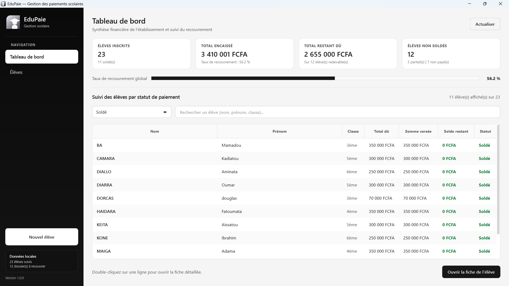
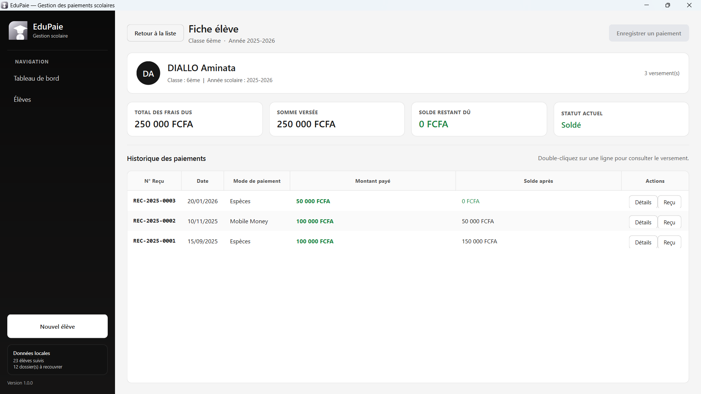
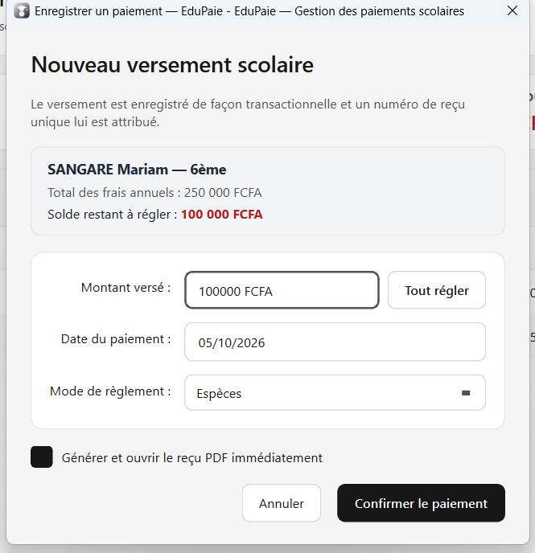
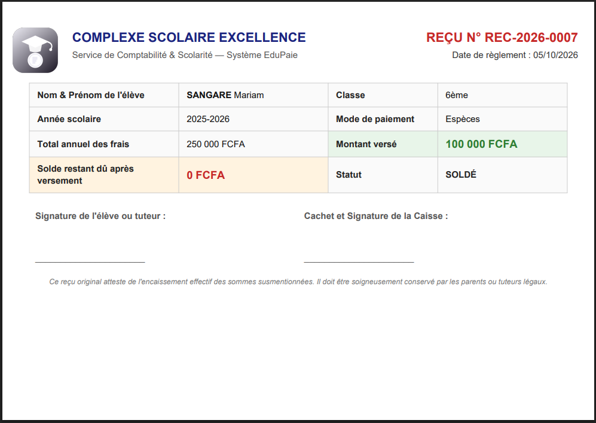

# EduPaie : gestion des paiements scolaires

EduPaie est une application de bureau destinée au suivi des frais de scolarité. Elle permet d’enregistrer les élèves et leurs paiements, de consulter les soldes et de produire des reçus PDF numérotés. L’application est écrite en Python avec PySide6 et utilise SQLite pour stocker les données localement.

Projet réalisé dans le cadre du brief « EduPaie » de l’Académie Digitale Numérique (ADN), programme P3 DEV WEB 1, Lomé (Togo). Travail individuel.

## Fonctions principales

- Gestion des élèves : ajout, modification, recherche, filtre par classe et suppression lorsqu’aucun paiement n’est associé.
- Calcul du montant payé, du solde restant et du statut de paiement (Soldé, Partiellement payé, Non payé).
- Enregistrement des paiements par espèces, chèque, virement ou Mobile Money. Un paiement supérieur au solde restant est refusé.
- Consultation de l’historique et du détail des paiements.
- Génération et réimpression de reçus PDF numérotés au format `REC-AAAA-NNNN`.
- Tableau de bord avec les principaux totaux et un suivi par statut.

## Captures d’écran

| Tableau de bord | Fiche élève |
|---|---|
|  |  |

| Enregistrement d’un paiement | Reçu PDF |
|---|---|
|  |  |

## Prérequis

- **Python 3.10 ou supérieur** (développé et testé avec Python 3.14 sous Windows 11).
- Windows 10 ou 11 pour utiliser les scripts de build fournis. L’application peut aussi être lancée avec Python sur d’autres systèmes compatibles avec PySide6.

---

## Installation

Cloner le dépôt, créer un environnement virtuel et installer les dépendances :

```powershell
git clone https://github.com/samTompkins17/edupaie.git
cd edupaie
python -m venv .venv
.\.venv\Scripts\Activate.ps1
python -m pip install -r requirements.txt
```

Sous Git Bash, l’activation de l’environnement se fait avec `source .venv/Scripts/activate`.

Puis lancer l’application :

```powershell
python main.py
```

Au premier lancement, EduPaie crée les tables nécessaires. Le dépôt contient aussi une base de démonstration (`data/edupaie.db`). Pour la recréer avec 18 élèves et 25 paiements, exécuter :

```powershell
python db/seed.py
```

Cette commande efface les données présentes dans la base de travail et les remplace par les données de démonstration.

## Tests

Depuis la racine du projet, avec l’environnement virtuel activé :

```powershell
python -m unittest discover -s tests -v
```

La suite couvre notamment les clés étrangères, le calcul du solde et des statuts, le refus des dépassements de solde, la numérotation et l’unicité des reçus, la génération du PDF, les statistiques du tableau de bord, la séparation des couches et les performances sur 2 000 élèves.

## Documentation

Le dossier `docs/` contient les livrables du projet :

- `docs/Documentation_EduPaie.docx` : documentation technique (architecture, choix techniques, limites connues).
- `docs/Manuel_utilisateur_EduPaie.docx` : manuel utilisateur d’une page.
- `docs/Schema_base_de_donnees_EduPaie.docx` : MCD, MLD, dictionnaire de données et script SQL.
- `docs/schema/` : sources du MCD et du MLD (`mcd.mmd`, `mld.mmd`, `mcd.dot`, `mld.dot`) et images exportées.
- `docs/captures/` : captures d’écran de l’application.

Le script SQL de création des tables est `db/schema.sql`.

## Organisation du code

Le code est réparti par rôle : `ui/` contient les écrans, `services/` les règles métier et `repositories/` les requêtes SQLite. Aucun widget n’exécute de requête SQL, et les couches basses n’importent rien de `ui/`.

```text
├── main.py                 # Démarrage de l’application
├── db/                     # Connexion, schéma et données de démonstration
├── repositories/           # Accès aux données (tout le SQL)
├── services/               # Logique métier
├── ui/                     # Interface PySide6
├── receipts/               # Création des reçus PDF
├── utils/                  # Chemins, formatage
├── resources/              # Logos et icônes
├── tests/                  # Tests automatisés
├── tools/                  # Build installateur, capture, smoke-test, assets
├── docs/                   # Documentation, schéma, captures
├── data/                   # Base SQLite de démonstration
├── EduPaie.spec            # Configuration PyInstaller
├── build.bat               # Tests et build sous Windows (PowerShell, cmd)
├── build.sh                # Même chose pour Git Bash
└── requirements.txt        # Dépendances Python
```

## Construire l’exécutable

Sous Windows, le script `build.bat` génère les ressources, lance les tests, puis construit l’exécutable autonome `dist/EduPaie.exe`. Il se lance depuis PowerShell ou cmd :

```powershell
.\build.bat
```

Depuis Git Bash, utiliser `./build.sh` (ou `cmd //c build.bat`). L’étape de compression de PyInstaller peut rester silencieuse plusieurs minutes : ne pas interrompre le build.

Le build peut aussi être lancé directement avec PyInstaller :

```powershell
python -m PyInstaller EduPaie.spec --noconfirm --clean
```

Dans la version empaquetée, la base modifiable est copiée dans `%APPDATA%\EduPaie\` au premier lancement. Les reçus PDF sont enregistrés dans `Documents\EduPaie\Recus\`.

## Installer sur un PC (installateur Windows)

Le script `tools/build_installer.bat` produit un véritable installateur Windows : EduPaie est alors **installé de façon permanente** sur le PC (il ne disparaît pas à la fermeture), accessible depuis le **menu Démarrer**, avec un **désinstalleur** dans « Applications et fonctionnalités ».

Prérequis (une seule fois) : Inno Setup 6 :

```powershell
winget install -e --id JRSoftware.InnoSetup
```

Par défaut, la commande construit l’édition démo avec 18 élèves et 25 paiements :

```powershell
tools\build_installer.bat
```

Pour générer une édition vierge, destinée au déploiement dans une école :

```powershell
tools\build_installer.bat clean
```

Les installateurs sont créés dans `output/` : `EduPaie-Setup-1.0.0.exe` pour la démo et `EduPaie-Setup-1.0.0-vierge.exe` pour l’édition vierge. Ils s’installent sur Windows 10/11 sans droit administrateur ; le dossier d’installation peut être choisi dans l’assistant.

À la désinstallation, les données scolaires (`%APPDATA%\EduPaie\edupaie.db`) sont **conservées** : réinstaller EduPaie les retrouve. Pour repartir d’une base vierge, supprimer ce dossier après avoir fermé l’application.

L’installateur n’étant pas signé numériquement, Windows SmartScreen peut afficher « Éditeur inconnu » : choisir *Informations complémentaires*, puis *Exécuter quand même*.

## Workflow Git

- `main` : version stable.
- `develop` : intégration.
- une branche par fonctionnalité (`feature/f1-gestion-eleves` à `feature/f6-tableau-de-bord`, `feature/installateur-windows`) et par correction (`fix/…`, `perf/…`, `refactor/…`), fusionnées dans `develop` avec `--no-ff`.

Les messages de commit suivent la convention `feat:`, `fix:`, `refactor:`, `perf:`, `test:`, `build:`, `docs:`, `chore:`.

## Auteur

SEGBEGNO Kossi Alexis Samuel : Académie Digitale Numérique (ADN), Lomé, Togo.