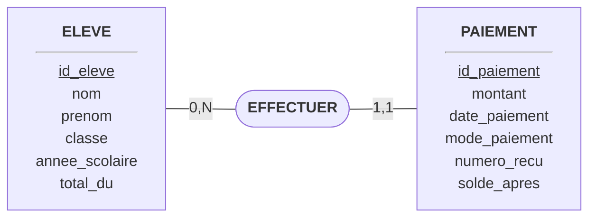
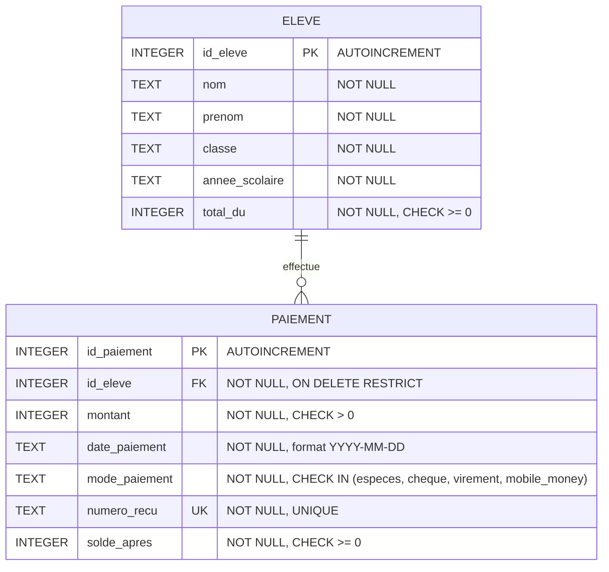
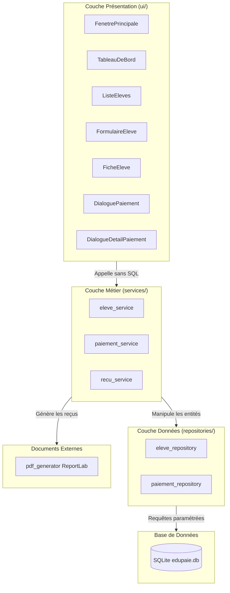

# EduPaie — Documentation Technique & Fonctionnelle

**Système Desktop de Gestion des Frais et Paiements Scolaires**  
*Technologies : Python 3.10+ • PySide6 (Qt) • SQLite3 natif • ReportLab*

---

## 1. Présentation générale

**EduPaie** est une application de bureau conçue pour équiper les secrétariats et services d'intendance d'établissements scolaires. Elle répond à un besoin critique : gérer avec rigueur et simplicité les inscriptions d'élèves, les frais de scolarité annuels, l'enregistrement des versements échelonnés, le suivi des soldes en temps réel, et l'émission de reçus de caisse certifiés.

### Objectifs fondamentaux
- **Simplicité d'usage** : interface intuitive, moderne et utilisable par un opérateur non-informaticien sans formation préalable.
- **Fiabilité comptable** : impossibilité totale d'enregistrer un versement excédant le solde dû, garantie d'intégrité référentielle par clés étrangères, transactions atomiques (ACID).
- **Traçabilité absolue** : chaque encaissement est scellé par un numéro de reçu unique annuel (`REC-AAAA-NNNN`) et peut être réimprimé à l'identique à tout moment.
- **Autonomie complète** : fonctionnement hors-ligne (stockage SQLite local), sans dépendance serveur, packagé en un exécutable autonome Windows.

---

## 2. Modélisation des données

La modélisation a été élaborée selon la méthode Merise (MCD) puis traduite en modèle relationnel (MLD) conforme au standard SQLite.

### 2.1. Modèle Conceptuel des Données (MCD)

- Un élève peut effectuer **zéro ou plusieurs paiements** (`0,N`).
- Un paiement est obligatoirement effectué par **un et un seul élève** (`1,1`).

### 2.2. Modèle Logique des Données (MLD Relationnel)

### 2.3. Contraintes d'intégrité appliquées
- **Clé étrangère stricte** : `id_eleve` dans `paiement` référence `eleve(id_eleve)`. La clause `ON DELETE RESTRICT` empêche toute suppression accidentelle d'un élève tant qu'il possède des versements enregistrés.
- **Vérifications de domaine (CHECK)** :
  * `total_du >= 0` : le coût des études ne peut être négatif.
  * `montant > 0` : un versement doit obligatoirement être strictement positif.
  * `solde_apres >= 0` : le solde d'un élève après paiement ne peut jamais devenir négatif.
  * `mode_paiement IN ('especes', 'cheque', 'virement', 'mobile_money')`.
- **Unicité (UNIQUE)** : `numero_recu` est soumis à une contrainte d'unicité globale au niveau de la table.
- **Activation obligatoire** : `PRAGMA foreign_keys = ON` est systématiquement exécuté dès l'ouverture de chaque connexion dans `db/connection.py`.

---

## 3. Architecture logicielle en couches

Pour garantir la pérennité, la lisibilité et la testabilité du code, l'application respecte une séparation stricte en 3 niveaux :

### Responsabilités et règles d'isolation
1. **Couche Présentation (`ui/`)** :
   - Composants PySide6 purs (fenêtres, dialogues, tables, boutons).
   - **Règle absolue : aucun import SQL, aucune clause SELECT/INSERT/UPDATE**.
   - Communique exclusivement par appel de méthodes de la couche `services/`.
2. **Couche Logique Métier (`services/`)** :
   - Calcul du solde (`total_du - somme_paiements`) et déduction du statut.
   - Contrôle des règles de gestion (refus des paiements > solde, refus de suppression).
   - Gestion des transactions SQLite pour l'insertion atomique et l'attribution séquentielle du reçu.
   - **Règle absolue : aucun import de PySide6, code métier indépendant de l'IHM**.
3. **Couche Accès aux Données (`repositories/`)** :
   - Fonctions CRUD directes exécutant du SQL exclusivement paramétré avec des marqueurs `?`.
   - Utilisation de `sqlite3.Row` pour restituer des dictionnaires propres.

---

## 4. Parcours des écrans et ergonomie

L'interface adopte la charte graphique moderne de PySide6 (thème Fusion, palette contrastée bleu indigo `#1a237e`, vert forêt `#2e7d32` et rouge carmin `#c62828`).

### Écran 1 : Fenêtre principale (`ui/main_window.py`)
- Barre latérale fixe à gauche offrant un accès direct en un clic au **Tableau de bord** et au répertoire des **Élèves**.
- Zone centrale gérée par un `QStackedWidget` garantissant des transitions fluides sans ouverture de fenêtres multiples encombrantes.
- Barre d'état et intercepteur global d'exceptions.

### Écran 2 : Tableau de bord financier (`ui/dashboard.py`)
- **4 Cartes d'indicateurs visuels** :
  1. Nombre total d'élèves enregistrés et effectif soldé.
  2. Total des fonds encaissés (FCFA) et taux de recouvrement global (en %).
  3. Total restant à recouvrer (FCFA) et nombre de familles redevables.
  4. Nombre d'élèves non soldés.
- **Tableau de suivi avec filtre d'état** :
  * Permet d'isoler en un clic les élèves *Non soldés*, *Partiellement payés*, *Non payés* ou *Soldés*.
  * Recherche textuelle dynamique multi-colonnes.
  * Double-clic sur une ligne pour ouvrir instantanément la fiche individuelle.

### Écran 3 : Répertoire des élèves (`ui/eleve_list.py`)
- Affichage sous forme de tableau interactif : Nom, Prénom, Classe, Année scolaire, Total dû, Solde restant, Statut coloré.
- Barre de recherche en temps réel et filtre déroulant par classe scolaire.
- Barre d'action : boutons *Ajouter un élève*, *Modifier*, *Supprimer*, *Voir la fiche*, *Enregistrer paiement*.

### Écran 4 : Formulaire élève (`ui/eleve_form.py`)
- Dialogue modal clair et rapide de saisie.
- Suggestions automatiques des classes existantes avec saisie libre autorisée.
- Formatage automatique des montants avec incrément par pas de 5 000 FCFA.

### Écran 5 : Fiche détaillée élève (`ui/eleve_fiche.py`)
- Synthèse financière sous forme de 4 blocs : *Total dû*, *Déjà payé*, *Solde restant*, *Statut*.
- Bouton *+ Enregistrer un paiement* (automatiquement désactivé si l'élève est déjà soldé).
- Tableau d'historique chronologique de tous les règlements de l'élève.
- Boutons d'action par versement : consultation détaillée (`ui/paiement_detail.py`) et réimpression directe du reçu PDF.

### Écran 6 : Dialogue d'enregistrement de versement (`ui/paiement_dialog.py`)
- Rappel clair de l'identité de l'élève et du montant restant à solder.
- Montant pré-rempli par défaut avec le montant du solde restant.
- Blocage immédiat avec avertissement explicite si l'utilisateur saisit une somme supérieure au solde restant.
- Case à cocher permettant l'ouverture instantanée du PDF lors de la confirmation.

---

## 5. Règles de gestion métier (Spécifications F1 à F6)

| Règle | Implémentation | Comportement en cas d'anomalie |
|---|---|---|
| **Calcul du solde** | `solde = total_du - SUM(montant)` | Calculé dynamiquement par `eleve_service`, jamais stocké de façon redondante dans `eleve`. |
| **Statut dérivé** | • `Soldé` si solde = 0 • `Partiellement payé` si solde > 0 et nb_versements > 0 • `Non payé` si nb_versements = 0 | Statut calculé en temps réel par la couche métier. |
| **Plafond du versement** | Le montant saisi doit être `<= solde_restant` et `> 0`. | Rejet immédiat par `paiement_service` avec message d'erreur bloquant. |
| **Numérotation du reçu** | Format `REC-AAAA-NNNN` remis à 1 au changement d'année civile. | Généré au sein de la transaction SQLite par `recu_service`. Contrainte `UNIQUE` en base. |
| **Suppression d'élève** | Interdite dès lors qu'au moins 1 paiement existe. | Rejet avec explication dans `eleve_service` + clause `ON DELETE RESTRICT` SQL. |
| **Réimpression du reçu** | Si le fichier PDF existe sur le disque, réouverture directe du même fichier. Sinon régénération déterministe. | Document certifié rigoureusement identique à l'original. |

---

## 6. Choix techniques et justification

1. **Python 3.10+ & PySide6** :
   - Solution officielle de The Qt Company pour Python.
   - Performances graphiques natives de Qt 6, robustesse éprouvée sur Windows, indépendance vis-à-vis des composants web.
2. **SQLite natif sans ORM** :
   - Zéro dépendance externe lourde : la bibliothèque standard `sqlite3` assure une portabilité totale.
   - Lisibilité intégrale des requêtes SQL pour la soutenance orale.
   - Sécurité maximale contre les injections SQL grâce aux requêtes paramétrées avec tuples.
3. **ReportLab pour la génération des reçus** :
   - Moteur de composition vectorielle haute précision.
   - Génération de fichiers PDF légers (moins de 5 Ko par reçu) et universellement lisibles ou imprimables sur toute imprimante de caisse ou bureautique.
4. **PyInstaller (`--onefile --windowed`)** :
   - Production d'un binaire autonome `.exe` ne nécessitant aucune installation de Python sur le poste client.
   - Emplacement sécurisé des données : copie automatique de la base dans `%APPDATA%/EduPaie/` pour permettre l'écriture permanente sans conflit avec le dossier temporaire `_MEIPASS`.

---

## 7. Sécurité et robustesse

- **Intercepteur global d'exceptions (`sys.excepthook`)** :
  Configuré dans `main.py`, il capture toute erreur inattendue, consigne la pile d'appels complète dans `edupaie.log` et informe poliment l'utilisateur via une `QMessageBox.critical`, empêchant l'arrêt brutal du programme.
- **Transactions ACID** :
  L'enregistrement d'un versement, la réservation du numéro séquentiel et la vérification du solde se déroulent au sein d'un bloc `with conn:`. Si une erreur survient, l'ensemble est annulé (ROLLBACK automatique).

---

## 8. Limites connues et perspectives d'évolution

- **Périmètre actuel mono-poste** : la base SQLite locale est conçue pour un poste unique de secrétariat. Une extension vers PostgreSQL permettrait le travail collaboratif de plusieurs caissiers en réseau.
- **Rôles et authentification** : l'accès actuel est libre sur le poste de travail. Une version ultérieure pourra intégrer une mire de connexion avec profils (Administrateur, Secrétaire, Auditeur).
- **Export tableur** : ajout possible d'une fonction d'export Excel/CSV de la liste des impayés pour la direction de l'école.
